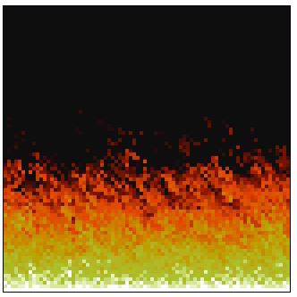

    

# Doom Fire Algorithm
Fire effect from Doom implemented in JS and using a Table to render the final effect.
<b>Excessive CPU Usage</b>

This project was inspired by [this article](https://github.com/filipedeschamps/doom-fire-algorithm).